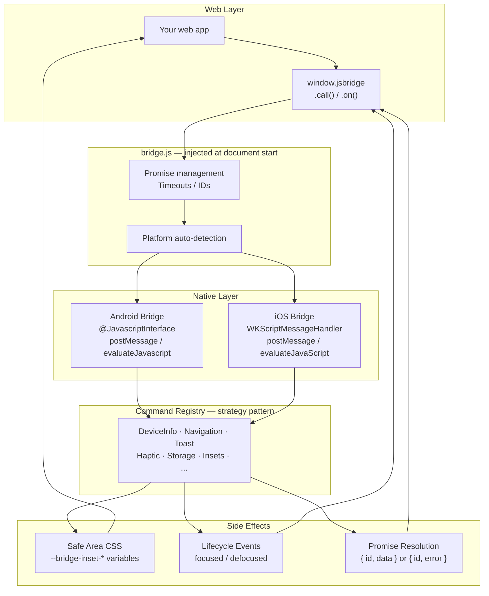

# jsbridge

[](https://github.com/kibotu/js-bridge/actions/workflows/android.yml)
[](https://github.com/kibotu/js-bridge/actions/workflows/ios.yml) [](https://central.sonatype.com/artifact/net.kibotu/js-bridge)
 [](https://jitpack.io/#kibotu/js-bridge)


A unified, promise-based JavaScript bridge for bidirectional communication between web content and native mobile apps. `window.jsbridge` works identically on Android and iOS. Life's too short for platform `if` statements.

---

## Why jsbridge?

If you've built web content inside a native app, you know the drill. Android gives you `@JavascriptInterface` with string callbacks. iOS gives you `WKScriptMessageHandler` with a completely different API. You end up with code like this:

```js
// The "before" world. We've all been here.
function getDeviceInfo() {
  if (window.AndroidBridge) {
    const cbName = 'onDeviceInfo_' + Date.now();
    window[cbName] = function (json) {
      const result = JSON.parse(json); // Android sends strings, naturally
      delete window[cbName];
      doSomethingWith(result);
    };
    window.AndroidBridge.getDeviceInfo(cbName);
  } else if (window.webkit?.messageHandlers?.nativeBridge) {
    window.onDeviceInfoResult = function (result) {
      doSomethingWith(result); // iOS sends objects, because why be consistent
    };
    window.webkit.messageHandlers.nativeBridge.postMessage({
      action: 'getDeviceInfo', callbackName: 'onDeviceInfoResult'
    });
  } else {
    doSomethingWith({ platform: 'desktop' }); // shrug
  }
}
```

With jsbridge, the same thing is:

```js
const info = await jsbridge.call('deviceInfo');
```

That's it. One line. Both platforms. Promises. No callbacks polluting `window`. No platform sniffing.

### The version hell problem

Without a unified versioning scheme, backwards compatibility turns into archaeology:

```js
// Real code from a real codebase. Names changed to protect the guilty.
if (platform === 'android' && semver.gte(appVersion, '4.2.0')) {
  AndroidBridge.showToastV2(JSON.stringify({ message, style: 'custom' }));
} else if (platform === 'android' && semver.gte(appVersion, '3.0.0')) {
  AndroidBridge.showToast(message);
} else if (platform === 'ios' && semver.gte(appVersion, '4.1.0')) {
  webkit.messageHandlers.toast.postMessage({ message, style: 'custom' });
} else if (platform === 'ios') {
  webkit.messageHandlers.nativeBridge.postMessage({ type: 'toast', message });
} else {
  alert(message); // desktop fallback, the last refuge
}
```

With jsbridge, schema versioning is a single integer:

```js
if (jsbridge.schemaVersion >= 2) {
  await jsbridge.call('showToast', { message, style: 'custom' });
} else {
  await jsbridge.call('showToast', { message });
}
```

No semver parsing, no platform branching, no archaeological expeditions into old release notes. Native silently ignores messages from newer schema versions. Your call times out, you fallback gracefully.

### What jsbridge gives you

- **One API, both platforms.** Write bridge calls once. Ship everywhere.
- **Promises, not callbacks.** `async`/`await` all the way down. No more `window.callbackXyz_12345`.
- **Schema versioning.** One integer instead of platform x version matrices.
- **Built-in commands.** Navigation bars, system bars, safe area, haptics, storage, analytics. Ready to go.
- **Easy to extend.** Adding a new native command is ~50 lines. You never touch bridge infrastructure.
- **Easy to test.** Mock handler for desktop, debug logging, browser DevTools support.

---

## Architecture



The key insight: `bridge.js` is the single source of truth. Both platforms inject the exact same JavaScript. Native just templates in the bridge name and schema version. Web developers see one global (`window.jsbridge`), native developers see their familiar APIs (`@JavascriptInterface` / `WKScriptMessageHandler`).

---

## For Web Developers

### Quick Start

```js
await jsbridge.ready();

const info = await jsbridge.call('deviceInfo');
console.log(info.platform, info.model);

jsbridge.on((msg) => {
  const { action, content } = msg.data;
  if (action === 'lifecycle' && content.event === 'focused') refreshData();
});
```

That's the whole API. One method to call native (`call`), one to listen (`on`). Everything else is just different `action` strings.

### Core API

| Method | Description |
|--------|-------------|
| `jsbridge.ready()` | Returns a Promise that resolves when the bridge is initialized. Call this first. |
| `jsbridge.call(action, content?, opts?)` | Sends a request to native. Returns a Promise with the response. |
| `jsbridge.on(fn)` | Registers a handler for native-to-web messages. Supports multiple handlers. |
| `jsbridge.off(fn)` | Removes a previously registered handler. |
| `jsbridge.cancelAll()` | Rejects all pending promises and clears timeouts. Useful for navigation teardown. |
| `jsbridge.setDebug(bool)` | Enables verbose console logging. |
| `jsbridge.setMockHandler(fn)` | Registers a mock for desktop browser testing. |
| `jsbridge.platform` | `'android'` \| `'ios'` \| `'desktop'` (read-only) |
| `jsbridge.schemaVersion` | Integer version set by native (read-only) |
| `jsbridge.getStats()` | Returns `{ pendingRequests, schemaVersion, platform, handlers, debugEnabled }` |

### What You Get Out of the Box

All of these work on both platforms with zero native setup (just use `DefaultCommands.all()`):

| Category | Actions | What it does |
|----------|---------|--------------|
| **Navigation** | `topNavigation`, `bottomNavigation`, `systemBars` | Show/hide the top toolbar, bottom tab bar, status bar, system navigation. Web controls native chrome. |
| **UI** | `showToast`, `showAlert`, `haptic`, `copyToClipboard` | Native toast, alert dialogs, haptic feedback, clipboard. Things web can't do well on its own. |
| **Device** | `deviceInfo`, `networkState`, `openSettings`, `requestPermissions` | Platform, OS version, model, connectivity, native settings screen, runtime permissions. |
| **Storage** | `saveSecureData`, `loadSecureData`, `removeSecureData` | Encrypted storage backed by Keychain (iOS) and EncryptedSharedPreferences (Android). |
| **Layout** | `getInsets` + CSS custom properties | Safe area insets, keyboard height, bar heights. Pushed automatically as CSS variables. |
| **Lifecycle** | `lifecycle` events via `on()` | Know when your screen is actually visible (not buried under modals or other tabs). |
| **Analytics** | `trackEvent`, `trackScreen` | Fire-and-forget. Don't even `await` these. |
| **Navigation** | `navigation` | Load URLs in-app or externally, go back. |

That's a lot of native capability accessible from a single `await jsbridge.call(...)`.

### Message Shape

```js
await jsbridge.call('actionName', { key: 'value' }, { timeout: 5000 });
```

`call()` also accepts the full message object for backward compatibility:

```js
await jsbridge.call({
  data: {
    action: 'actionName',       // what to do
    content: { key: 'value' }   // optional payload
  }
}, { timeout: 5000 });          // optional timeout (default 30s)
```

### Actions Reference

#### Device & System

```js
const info = await jsbridge.call('deviceInfo');
// → { platform, osVersion, model, appVersion, ... }

const net = await jsbridge.call('networkState');
// → { connected: true, type: 'wifi' }

await jsbridge.call('openSettings');

const insets = await jsbridge.call('getInsets');
// → { statusBar: { height, visible }, systemNavigation: {...}, keyboard: {...}, safeArea: { top, right, bottom, left } }
```

#### UI

```js
await jsbridge.call('showToast', { message: 'Hey!', duration: 'short' });
await jsbridge.call('showAlert', { title: 'Hi', message: 'Hello', buttons: ['OK', 'Cancel'] });
await jsbridge.call('haptic', { vibrate: true });
await jsbridge.call('copyToClipboard', { text: 'copied!' });
```

#### Navigation

```js
// Top navigation bar
await jsbridge.call('topNavigation', { isVisible: true, title: 'Home', showUpArrow: false });

// Bottom navigation bar
await jsbridge.call('bottomNavigation', { isVisible: false });

// System bars (Android only -- iOS ignores this gracefully)
await jsbridge.call('systemBars', { showStatusBar: false, showSystemNavigation: false });

// URL navigation
await jsbridge.call('navigation', { url: 'https://example.com', external: true });
await jsbridge.call('navigation', { goBack: true });
```

#### Secure Storage

```js
await jsbridge.call('saveSecureData', { key: 'token', value: 'abc123' });
const { value } = await jsbridge.call('loadSecureData', { key: 'token' });
await jsbridge.call('removeSecureData', { key: 'token' });
```

Backed by Keychain (iOS) and EncryptedSharedPreferences (Android).

#### Analytics (Fire-and-Forget)

Don't `await` these. No response needed, zero latency:

```js
jsbridge.call('trackEvent', { event: 'button_click', params: { screen: 'home' } });
jsbridge.call('trackScreen', { screenName: 'Home' });
```

### Edge-to-Edge & Safe Area

Modern mobile apps use edge-to-edge layouts. Your web content extends behind status bars and navigation bars. Great for immersive experiences like image galleries or video players. Terrible for buttons your users need to actually tap.

jsbridge solves this with native-driven CSS custom properties. Native automatically pushes inset values whenever bars change, the device rotates, or the keyboard appears. You don't call anything. Just use CSS:

```css
body {
  padding-top: var(--bridge-inset-top, env(safe-area-inset-top, 0px));
  padding-bottom: var(--bridge-inset-bottom, env(safe-area-inset-bottom, 0px));
}
```

The triple fallback (`bridge variable` → `env()` → `0px`) means this works everywhere: in the app, in a regular browser, on desktop.

**Available CSS custom properties:**

| Property | What it represents |
|----------|-------------------|
| `--bridge-inset-top` | Combined top inset (status bar + top nav when relevant) |
| `--bridge-inset-bottom` | Combined bottom inset (bottom nav + system nav when relevant) |
| `--bridge-inset-left` | Left inset (landscape, foldables) |
| `--bridge-inset-right` | Right inset (landscape, foldables) |
| `--bridge-status-bar` | Status bar height alone |
| `--bridge-top-nav` | Top navigation bar height alone |
| `--bridge-bottom-nav` | Bottom tab bar height alone |
| `--bridge-system-nav` | System navigation bar height alone (Android) |

**Example: immersive gallery with safe interactive elements**

```js
// Go full-screen: hide all native chrome
await jsbridge.call('topNavigation', { isVisible: false });
await jsbridge.call('bottomNavigation', { isVisible: false });
await jsbridge.call('systemBars', { showStatusBar: false, showSystemNavigation: false });
```

```css
.gallery {
  /* Content goes edge-to-edge -- behind status bar, behind system nav */
  position: fixed;
  inset: 0;
}

.gallery-close-button {
  /* But the close button stays in the safe area so users can actually tap it */
  position: fixed;
  top: calc(12px + var(--bridge-inset-top, env(safe-area-inset-top, 0px)));
  right: 12px;
}

.gallery-controls {
  /* Bottom controls respect the system navigation area */
  position: fixed;
  bottom: calc(12px + var(--bridge-inset-bottom, env(safe-area-inset-bottom, 0px)));
  left: 0;
  right: 0;
}
```

**Automatic safe padding based on bar visibility.** When you toggle the top or bottom navigation, native automatically recalculates and pushes updated CSS values. Hide the top bar? `--bridge-inset-top` updates to include the status bar height so your content doesn't slip underneath it. Show it again? Inset goes back to `0` because the native bar already covers the status bar. You don't manage any of this. It just works.

For JavaScript layout calculations (e.g. canvas sizing), query on demand:

```js
const insets = await jsbridge.call('getInsets');
// → { safeArea: { top: 44, bottom: 34, ... }, statusBar: { height: 44 }, ... }
```

### Focus Awareness

Here's a fun problem: your WebView is happily displaying content, but the user opens a bottom sheet, a modal dialog, switches to another tab in a ViewPager, or navigates to a different screen that covers your WebView. The web content has no idea. No `visibilitychange` event, no `blur`, nothing. As far as your JavaScript knows, the page is still in the foreground.

jsbridge fixes this. Native sends `lifecycle` events whenever your screen gains or loses focus:

```js
jsbridge.on((msg) => {
  const { action, content } = msg.data;
  if (action === 'lifecycle') {
    if (content.event === 'focused') {
      refreshData();     // screen is visible again -- refresh stale data
      resumeAnimations();
    }
    if (content.event === 'defocused') {
      pauseAnimations(); // save battery, stop polling
    }
  }
});
```

This covers all the tricky cases:
- Modal/dialog/bottom sheet presented over the WebView
- User switches tabs in a native tab bar or ViewPager
- App goes to background and comes back
- Another ViewController/Fragment pushed on top of the WebView

On `focused`, native also re-pushes safe area CSS, so your layout is always correct after returning from another screen.

### Schema Versioning

Simple integer, auto-attached to every message. Native silently ignores messages from newer schema versions. Your call will timeout, and you can fallback:

```js
if (jsbridge.schemaVersion >= 2) {
  await jsbridge.call('fancyNewThing');
} else {
  oldApproach();
}
```

**Bump when:** breaking format changes, removing commands, incompatible behavior.
**Don't bump when:** adding commands, adding optional fields, fixing bugs.

### Error Handling

```js
try {
  const info = await jsbridge.call('deviceInfo', null, { timeout: 5000 });
} catch (e) {
  if (e.message.includes('timeout')) console.warn('Native not responding');
  else console.error(e.code, e.message);
}
```

Errors have `.code` (e.g. `UNKNOWN_ACTION`, `INVALID_PARAMETER`) and `.message`.

### Testing & Debugging

#### Desktop Mock Mode

When no native bridge is detected, `jsbridge.platform` returns `'desktop'`. Register a mock to develop and test without a device:

```js
jsbridge.setMockHandler((msg) => {
  if (msg.data.action === 'deviceInfo') return { platform: 'desktop', model: 'Chrome' };
  if (msg.data.action === 'networkState') return { connected: true, type: 'wifi' };
  return {};
});
```

The `index.html` demo page does this automatically. Open it in any browser and everything works.

#### Chrome DevTools (Android)

1. Connect your Android device via USB (enable USB debugging)
2. Open `chrome://inspect` in Chrome
3. Find your WebView under **Remote Target** and click **Inspect**
4. In the Console tab, you have full access:

```js
// Try it live
await jsbridge.call('deviceInfo')
jsbridge.getStats()
jsbridge.setDebug(true) // watch all messages fly by in the console
```

#### Safari Web Inspector (iOS)

1. Enable Web Inspector on your device: Settings → Safari → Advanced → Web Inspector
2. Connect via USB, open Safari on your Mac
3. Develop menu → your device → your WebView
4. Same console access as Chrome:

```js
await jsbridge.call('showToast', { message: 'Hello from Safari!' })
jsbridge.platform  // → 'ios'
```

#### Debug Logging

Turn on verbose logging anywhere to see every message going back and forth:

```js
jsbridge.setDebug(true);
// Now every call(), response, and native message logs to the console
// [jsbridge] Calling native: { id: "msg_...", data: { action: "deviceInfo" } }
// [jsbridge] Received response: { id: "msg_...", data: { platform: "Android", ... } }
```

`jsbridge.getStats()` gives you a snapshot of the bridge state. Handy for debugging stuck promises:

```js
jsbridge.getStats()
// → { pendingRequests: 0, schemaVersion: 1, platform: 'android', handlers: 1, debugEnabled: true }
```

### TypeScript

```typescript
interface CallOptions { timeout?: number; version?: number; }

interface Bridge {
  schemaVersion: number;
  platform: 'android' | 'ios' | 'desktop';
  ready(): Promise<void>;
  call<T = unknown>(action: string, content?: unknown, opts?: CallOptions): Promise<T>;
  call<T = unknown>(msg: { data: { action: string; content?: unknown } }, opts?: CallOptions): Promise<T>;
  on(handler: (msg: { data: { action: string; content?: unknown } }) => void): void;
  off(handler: Function): void;
  cancelAll(): void;
  setDebug(enabled: boolean): void;
  setMockHandler(handler: Function | null): void;
  getStats(): { pendingRequests: number; schemaVersion: number; platform: string; handlers: number; debugEnabled: boolean };
}

declare global { interface Window { jsbridge: Bridge } }
```

### Tips

- **Always** `await jsbridge.ready()` before anything else
- **Set timeouts** on calls: `{ timeout: 5000 }`. 30s default is generous
- **Don't await analytics.** Fire-and-forget is faster
- **Version-gate new features**: `if (jsbridge.schemaVersion >= 2) { ... }`
- **Cache device info.** It doesn't change mid-session
- **Batch with `Promise.all()`** for parallel operations
- **Register `on()` once** during init, route by `action`

### Platform Support

| Action | iOS | Android |
|--------|:---:|:-------:|
| `deviceInfo` | ✅ | ✅ |
| `networkState` | ✅ | ✅ |
| `openSettings` | ✅ | ✅ |
| `getInsets` | ✅ | ✅ |
| `showToast` | ✅ | ✅ |
| `showAlert` | ✅ | ✅ |
| `topNavigation` | ✅ | ✅ |
| `bottomNavigation` | ✅ | ✅ |
| `systemBars` | -- | ✅ |
| `haptic` | ✅ | ✅ |
| `navigation` | ✅ | ✅ |
| `copyToClipboard` | ✅ | ✅ |
| `lifecycleEvents` | ✅ | ✅ |
| `saveSecureData` | ✅ | ✅ |
| `loadSecureData` | ✅ | ✅ |
| `removeSecureData` | ✅ | ✅ |
| `requestPermissions` | ✅ | ✅ |
| `trackEvent` | ✅ | ✅ |
| `trackScreen` | ✅ | ✅ |

---

## For Native App Developers

### How It Works

The bridge is a thin decorator around each platform's native WebView messaging:

- **Android**: `@JavascriptInterface` on a `postMessage(String)` method + `evaluateJavascript()` for responses
- **iOS**: `WKScriptMessageHandler` + `evaluateJavaScript()` for responses

Both platforms inject the same JavaScript (`bridge.js`) into the WebView at document start. The JS auto-detects the platform and routes messages accordingly. Web developers see one API; you see your native APIs.

### Android Setup

Add the `jsbridge` library module to your project:

```kotlin
// settings.gradle.kts
include(":jsbridge")

// app/build.gradle.kts
dependencies {
    implementation(project(":jsbridge"))
}
```

Wire it up with explicit command configuration:

```kotlin
// All default commands
var bridgeRef: JavaScriptBridge? = null
val bridge = JavaScriptBridge.inject(
    webView = webView,
    commands = DefaultCommands.all(getBridge = { bridgeRef })
)
bridgeRef = bridge

// Or pick only the commands you need
val bridge = JavaScriptBridge.inject(
    webView = webView,
    commands = listOf(
        DeviceInfoCommand(),
        ShowToastCommand(),
        HapticCommand(),
    )
)

// Send events to web
bridge.sendToWeb(action = "lifecycle", content = mapOf("event" to "focused"))
```

### iOS Setup

Add the `JSBridge` Swift Package (local dependency):

```swift
// In your Package.swift or Xcode project
.package(path: "../JSBridge")
```

Wire it up with explicit command configuration:

```swift
import JSBridge

// All default commands
let bridge = JavaScriptBridge(
    webView: webView,
    viewController: self,
    commands: DefaultCommands.all(viewController: self, webView: webView)
)

// Or pick only the commands you need
let bridge = JavaScriptBridge(
    webView: webView,
    viewController: self,
    commands: [
        DeviceInfoCommand(),
        ShowToastCommand(viewController: self),
        HapticCommand(),
    ]
)

// Send events to web
bridge.sendToWeb(action: "lifecycle", content: ["event": "focused"])
```

### Sending Lifecycle Events

Web content has no way to know when it's been covered by a modal, buried in a tab, or returned to after a navigation stack change. It's your job to tell it. Luckily, it's one line:

```kotlin
// Android -- in your Activity or Fragment
override fun onWindowFocusChanged(hasFocus: Boolean) {
    super.onWindowFocusChanged(hasFocus)
    bridge.sendToWeb("lifecycle", mapOf("event" to if (hasFocus) "focused" else "defocused"))
    if (hasFocus) SafeAreaService.pushTobridge(bridge) // re-push safe area on return
}
```

```swift
// iOS -- in your ViewController (or use the WindowFocusObserver protocol)
func onWindowFocusChanged(hasFocus: Bool) {
    if hasFocus {
        bridge.sendToWeb(action: "lifecycle", content: ["event": "focused"])
        SafeAreaService.shared.pushToBridge(bridge)
    } else {
        bridge.sendToWeb(action: "lifecycle", content: ["event": "defocused"])
    }
}
```

The iOS sample app includes a `WindowFocusObserver` protocol that handles all the edge cases (modal presentation, tab switching, background/foreground, ViewPager) with a lightweight polling approach.

### Adding a New Command

This is the whole point of the architecture. Three steps, ~50 lines total:

**1. Create the handler:**

```kotlin
// Android
class MyCommand : BridgeCommand {
    override val action = "myAction"
    override suspend fun handle(content: Any?): Any? {
        val param = BridgeParsingUtils.parseString(content, "param")
        return JSONObject().apply { put("result", "done: $param") }
    }
}
```

```swift
// iOS
class MyCommand: BridgeCommand {
    let action = "myAction"
    func handle(content: [String: Any]?) async throws -> [String: Any]? {
        let param = content?["param"] as? String ?? ""
        return ["result": "done: \(param)"]
    }
}
```

**2. Register it when creating the bridge:**

```kotlin
// Android
val bridge = JavaScriptBridge.inject(
    webView = webView,
    commands = DefaultCommands.all(getBridge = { bridge }) + MyCommand()
)
```

```swift
// iOS
let bridge = JavaScriptBridge(
    webView: webView, viewController: self,
    commands: DefaultCommands.all(viewController: self, webView: webView) + [MyCommand()]
)
```

**3. Call from web:**

```js
const result = await jsbridge.call('myAction', { param: 'hello' });
```

You didn't touch the bridge infrastructure, the JS layer, or any other command. That's the beauty of the command pattern.

### Native-Driven Safe Area CSS

Instead of making web poll for insets, native proactively pushes CSS custom properties:

```kotlin
// Android: called automatically on page load, bar changes, rotation, keyboard
bridge.updateSafeAreaCSS(
    insetTop = statusBarHeight + topNavHeight,
    insetBottom = bottomNavHeight + systemNavHeight,
    statusBarHeight = statusBarHeight,
    topNavHeight = topNavHeight,
    bottomNavHeight = bottomNavHeight,
    systemNavHeight = systemNavHeight
)
```

The `SafeAreaService` handles this automatically when using `DefaultCommands`. Top/bottom navigation commands recalculate and push updated CSS after every visibility change. The `BridgeWebViewClient` (Android) pushes on `onPageFinished`, and both platforms re-push when the window regains focus.

This is strictly better than injecting `padding-top: Xpx !important` because web controls where and how to use the values.

### Multiple Bridges Per WebView

You can register multiple bridges with different names on the same WebView, each handling different actions:

```kotlin
// Android
val mainBridge = JavaScriptBridge.inject(
    webView, bridgeName = "jsbridge",
    commands = listOf(DeviceInfoCommand(), ShowToastCommand())
)
val analyticsBridge = JavaScriptBridge.inject(
    webView, bridgeName = "analytics",
    commands = listOf(TrackEventCommand(), TrackScreenCommand())
)
```

```swift
// iOS
let mainBridge = JavaScriptBridge(
    webView: webView, viewController: self, bridgeName: "jsbridge",
    commands: [DeviceInfoCommand(), ShowToastCommand(viewController: self)]
)
let analyticsBridge = JavaScriptBridge(
    webView: webView, viewController: self, bridgeName: "analytics",
    commands: [TrackEventCommand(), TrackScreenCommand()]
)
```

```js
// Web -- each bridge is independent
await jsbridge.call('deviceInfo');
await analytics.call('trackEvent', { event: 'click' });
```

### Changing the Bridge Name

```kotlin
// Android
val bridge = JavaScriptBridge.inject(
    webView = webView,
    commands = DefaultCommands.all(),
    bridgeName = "myApp"
)
```

```swift
// iOS
let bridge = JavaScriptBridge(
    webView: webView, viewController: self,
    bridgeName: "myApp",
    commands: DefaultCommands.all(viewController: self, webView: webView)
)
```

One parameter. Everything else (the JS global, the callbacks, the message handler name) updates automatically.

### Response Format

Standardized across both platforms: `{ id, data?, error? }`. If `error` is present, it's a failure. If `data` is present (or both absent), it's a success. Return `null` from a command handler for fire-and-forget (no response sent).

### Message Protocol

```json
{
  "id": "msg_1234567890_1_abc123xyz",
  "version": 1,
  "data": {
    "action": "showToast",
    "content": { "message": "Hello!" }
  }
}
```

Version checking: if `version > SCHEMA_VERSION`, silently ignore. Web will timeout and fallback.

### Security

- The `window.jsbridge` object is `Object.freeze()`'d and non-writable
- Android: only `@JavascriptInterface`-annotated methods are exposed
- iOS: WKScriptMessageHandler with named handler registration
- All commands validate their input
- Threading: Android `@JavascriptInterface` runs on a background thread. All WebView operations are dispatched to main

---

## Project Structure

```
jsbridge/
├── bridge.js                  # Unified JS (single source of truth)
├── index.html                 # Demo page (symlinked into both sample apps)
├── android/
│   ├── jsbridge/              # Library module (net.kibotu.jsbridge)
│   │   ├── build.gradle.kts
│   │   └── src/main/java/net/kibotu/jsbridge/
│   │       ├── JavaScriptBridge.kt
│   │       ├── DefaultCommands.kt
│   │       ├── SafeAreaService.kt
│   │       ├── commands/      # One file per action
│   │       └── decorators/    # WebViewClient/ChromeClient wrappers
│   └── sample/                # Sample app (depends on :jsbridge)
│       └── src/main/java/net/kibotu/bridgesample/
├── ios/
│   ├── JSBridge/              # Swift Package
│   │   ├── Package.swift
│   │   └── Sources/JSBridge/
│   │       ├── JavaScriptBridge.swift
│   │       ├── DefaultCommands.swift
│   │       ├── SafeAreaService.swift
│   │       ├── Commands/      # One file per action
│   │       └── Resources/bridge.js
│   └── BridgeSample/          # Sample app (depends on JSBridge)
│       └── Views/
└── CHANGELOG.md
```

### Building

**Android:** Open `android/` in Android Studio, hit Run on the `:sample` module.
**iOS:** Open `ios/BridgeSample.xcodeproj` in Xcode, add JSBridge as a local SPM dependency, Cmd+R.

Both apps load the same `index.html` demo page with all bridge features.

---

## Performance

| Operation | Latency | Pattern |
|-----------|---------|---------|
| Fire-and-forget (analytics, haptic) | < 1ms | No `await` |
| Simple queries (deviceInfo) | 5-15ms | `await` |
| UI operations (toast, alert) | 10-30ms | `await` |
| Secure storage | 20-50ms | `await` |

Batch with `Promise.all()`. Cache what doesn't change. Don't await what doesn't matter.

---

## Changelog

### 3.0.0 (2026-02-21)

Library extraction. Breaking changes:

- **Android**: Bridge code extracted into `:jsbridge` library module (`net.kibotu.jsbridge`). Removed `BridgeMessageHandler` / `DefaultBridgeMessageHandler` indirection. Commands are now passed directly to `JavaScriptBridge.inject()`.
- **iOS**: Bridge code extracted into `JSBridge` Swift Package. Commands are now passed to `JavaScriptBridge(commands:)` init. No longer auto-registered.
- **Both platforms**: Commands are opt-in via explicit configuration. Use `DefaultCommands.all()` for all defaults, or pick individual commands.
- **Multiple bridges**: A single WebView can now host multiple named bridges (e.g. `jsbridge` + `analytics`) with independent command sets.
- **JS loading**: Bridge JavaScript is loaded from bundled resources (`res/raw/bridge.js` on Android, SPM resource on iOS) instead of inline strings.
- Directory structure: `android-sample/` → `android/`, `ios-sample/` → `ios/`

### 2.1.0 (2026-02-14)

- `call()` now accepts both `call(action, content?, opts?)` shorthand and `call(msg, opts?)` object form
- Added `cancelAll()` to reject all pending promises and clean up timeouts
- Fixed Android error response asymmetry. Command errors now correctly reject promises (aligned with iOS)
- Added `trackEvent` and `trackScreen` commands on Android
- Added `requestPermissions` command on iOS
- Added iOS `BridgeParsingUtils` dictionary extensions for consistent parameter parsing
- Migrated iOS `BridgeCommand` protocol from completion handlers to `async/await`

### 2.0.0 (2026-02-07)

Unified bridge release. Breaking changes:

- Bridge global renamed from `window.bridge` to `window.jsbridge` (configurable)
- Response format standardized to `{ id, data?, error? }` (iOS `success` field removed)
- `on()` now supports multiple handlers (use `off()` to remove)
- Unified callback names across platforms

New: `bridge.js` single source of truth, `platform` property, `off()`, `setMockHandler()`, `getStats()`, `getInsets` action, native-driven safe area CSS injection, desktop mock mode.

### 1.0.0 (2026-01-31)

Initial release. `call()`, `on()`, `ready()`, `setDebug()`. Android and iOS samples. Schema versioning. Command pattern.

---

## Support

If jsbridge saved you a few hours (or a few `if` statements), consider [buying me a coffee](https://buymeacoffee.com/kibotu).

## License

See [LICENSE](LICENSE) file.
